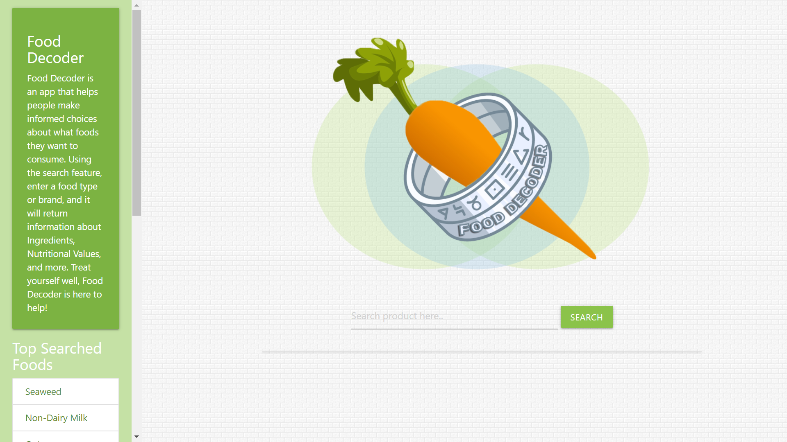
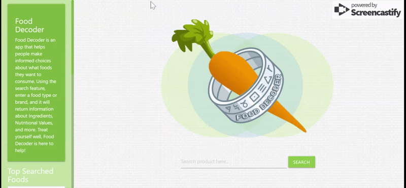
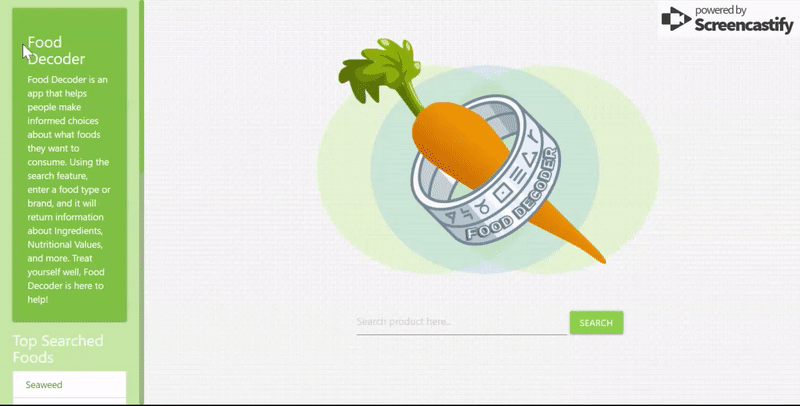

- [Landing Page](#landing-page)
- [Demo](#demo)
- [Built With](#built-with)
- [Usage](#usage)
- [Team](#team)
- [License](#license)

# Food Decoder

Independence Day (United States) is around the corner and you know what that means..no not the fireworks..I'm talking about having that **summertime barbecue!** :poultry_leg: :hamburger:

You are at your local supermarket and what is a barbecue without hot dogs? You head to the meat section and with great delight, you immediately noticed a holiday sale on your favorite brand of beef franks! You picked up the package with the right amount of franks in the package, but then you noticed that the sale was for the smaller pack. You head back to pick up the smaller package, but then you noticed that the packaging looks a bit different...Out of curiosity, you checked the nutritional label to see what makes this product different from the one you originally wanted. 

*Total Fat..okay. Sodium...not surprised. Total carb..the buns got this covered..:laughing: There's gotta be something else in here       -looks further down in the ingredient's list- Hmmm? Sorbitol? I think I've seen that somewhere before..I think in my chewing gum?...Hydrolized Corn Protein? Okay it has plant protein too, but what does "Hydrolized" mean?*

As your stream of thoughts guided you through a rabbit hole of questions and, ever so briefly, enter a state of existentialism; you've accepted that a sale is a sale and the festivities must happen. But, what are we putting into our body? Honey is honey and cinnamon is cinnamon, but what is Xanthan gum? How about tert-Butylhydroquinone? The underlying magnitude of this decision could ripple and affect your long term health in future--all because of the choice you make now. In the conciseness with similar sentiments shared in words from a renown food expert and enviromentalist, Joan Gussow:

> As for butter versus margarine, I trust cows more than chemists.

We came up with our app so we are able to find out what alternative products are out there, what said product is made up of, and the company behind the product all in a simple overview. Being able to know what other choices are out there and having awareness of the manufacturers behind them gives us, the consumers, accountability to what we are putting in our body. 

## Landing Page

## Demo

1. Start the search by typing in the keyword of the product (i.e. ketchup) you are looking for.
    - Or you could click on an item in the "Top Searched Food" located in the left column

2. Find the specific brand and product from the list.

3. Click anywhere on the row and it will expand and show details of the product such as the ingredients and provide a link to the manufacturer to learn more about the company. 

## Built With

- HTML/CSS

- Materialize

- Google Fonts

- Font Awesome 

- Javascript

- JQuery

- Open Food Facts API

- MediaWiki API

- Animate.css

- Firebase

## Usage

Click [here](https://luzanneb.github.io/Project1/) to get to the Food Decoder page.

If you have any suggestions or would like to report a bug, feel free to message any of us, in the team section, below! We would love to hear from you :smile:

## Team

[Nova](https://github.com/Nova-Xue)

[Celisse](https://github.com/CelisseD)

[Luzanne](https://github.com/LuzanneB)

[Andrew](https://github.com/ahok89)

## License

© 2019 Copyright C.L.A.N.

